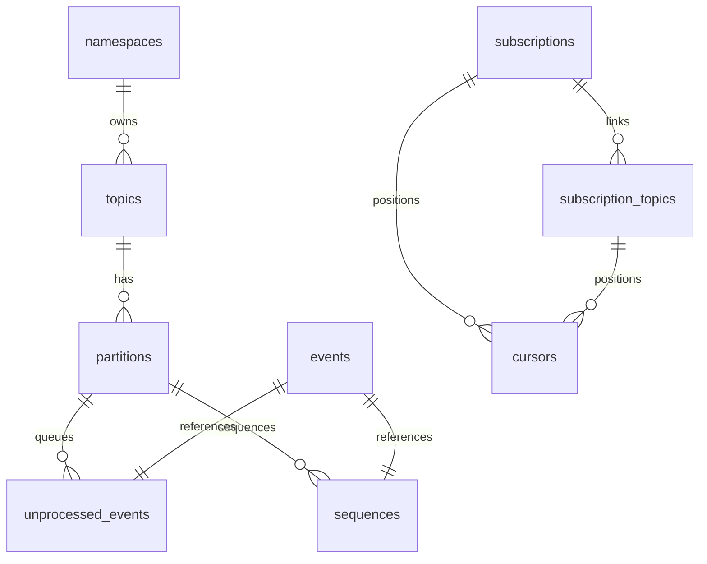
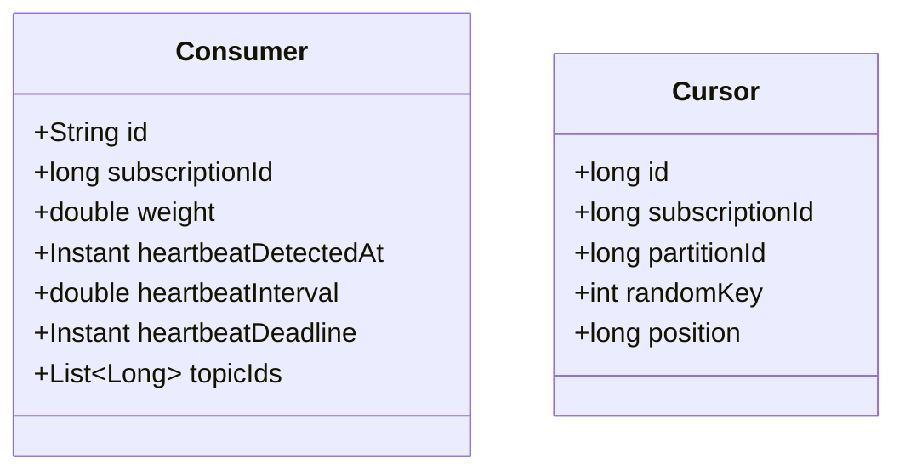

# Boxy


Boxy is a multi-tenant event streaming library that exposes Apache Pulsar-like semantics 
directly over a database’s transactional outbox. It targets monolithic applications that need event streaming without 
taking on the operational cost of running a Pulsar/Kafka deployment. 
Boxy turns your transactional outbox into an event stream and allows you to connect asynchronous consumers in your 
favorite programming language. 
Tenant isolation is provided through a hierarchical namespace system.

## Table of Contents

- [Design Highlights](#design-highlights)
- [Architecture Decisions](#architecture-decisions)
- [Limits](#limits)
- [Roadmap](#roadmap)
- [Boxy Core and Boxy DB Overview](#boxy-core-and-boxy-db-overview)
  - [Key Tables and Views](#key-tables-and-views)
  - [Subscription Statistics](#subscription-statistics)
- [Domain Classes](#domain-classes)
- [Consumer State](#consumer-state)
- [Heartbeats](#heartbeats)
- [Building the Project](#building-the-project)
- [Getting Started](#getting-started)
- [FAQ](#faq)
- [Contributing](#contributing)
- [License](#license)

## Design Highlights

- **Fair-share Load Balancing** across consumers, proportional to capacity weights
- **Low Consumer Lag**: p99 ~5ms for active partitions, and ~100ms for cold partitions
- **Scalable Polling**: consumers stagger check-ins to minimize database queries (e.g. ≈10 checks/s instead of hundreds)

## Architecture Decisions
- APIs for consumers and producers are designed to be easy to use.
- Publishing an event should be possible when only knowing the path and topic name.
- Third-party libraries are minimized.
- For safety: boxy never deletes events. Event deletion is left to be orchestrated by you.
- For easy portability across programming languages and runtimes, all mutations are strictly performed by stored procedures.
- Namespace and Topic Names are case-sensitive.

## Limits
- Each topic has a practical limit of 1024 partitions, and a technical limit of 65536 partitions
- Each subscription has a practical limit of 1024 consumers.
- The fully qualified namespace path and topic name has a limit of 4000 characters
- Each namespace name a limit of 500 characters.
- Each topic name has a limit of 500 characters.

---

## Boxy Core and Boxy DB Overview

Liquibase migrations for the schema are under `boxy-db/src/main/resources/db/changelog`. The schema models:



### Key Tables and Views

- **namespaces**: hierarchical containers for topics.
- **topics**: belong to namespaces and declare a partition count.
- **partitions**: per-topic shards that track a `high_watermark`.
  - **events**: raw event payloads; partition and sequence metadata are tracked separately.
  - **unprocessed_events**: queue linking newly published events to partitions until sequenced.
  - **sequences**: per-partition sequence numbers referencing single events (one row per event).
- **subscription_topics**: links subscriptions to the topics they consume and stores precomputed statistics.
- **cursors**: tracks the position per subscription and partition and stores the `subscription_id`,
  `subscription_topic_id`, and `topic_id` for join-free lookups. Each row is assigned a persistent
  `random_key` used for evenly distributing start positions among consumers.
- **consumers**: registers each consumer’s `subscription_id`, `weight`, `heartbeat_detected_at`, and `topic_ids` JSON array of topic identifiers.
- **subscriptions**: defines logical groups of consumers.
- **topics_cache**: in-memory table for quick topic lookups.

### Subscription Statistics

The `subscription_topics` table stores precomputed statistics that are updated with each consumer check-in:

- **heartbeat_interval**: Adaptive interval used for consumer heartbeats.
- **active_partitions**: Count of partitions with new events (high_watermark > position).
- **active_consumers**: Count of consumers with valid heartbeats.
- **active_consumers_weight**: Sum of weights of all active consumers in the subscription.
- **last_modified_at**: Timestamp of the last statistics update.

These statistics are used for:

- **Adaptive Heartbeat Intervals**: The heartbeat interval is adjusted based on the number of active consumers to maintain a target QPS (queries per second) for the cluster.

Precomputing these statistics reduces the need for expensive queries during consumer check-ins.

## Domain Classes

The Boxy Core module uses Java records to model the schema. Relevant classes:



## Heartbeats

Consumer-level heartbeat (in the consumers table) remains independent of per-partition state.

Rather than every consumer polling for events N-times per seconds, we define:

- T<sub>cycle</sub>: a fixed “heartbeat cycle” (e.g. 1 s)

- QPS<sub>target</sub>: the desired total heartbeats/sec for all active consumers of a subscription (e.g. 10 qps)

On each cycle, each consumer flips a weighted coin with probability `p = min(1, target_QPS / N_active)`, 
and only writes a heartbeat if it “wins” that flip.

Properties
- When N_active ≤ Q_target, then p = 1 → everyone writes → we get N_active QPS (fine for small clusters).
- When N_active > Q_target, then p = Q_target / N_active → expected cluster rate ≈ Q_target, irrespective of N.
- We detect failures in a bounded time: expected per-consumer heartbeat interval = 1 s / p = N_active / Q_target seconds;
  we pick the dead‐timeout to be a small multiple of that (e.g. 3×).


## Client Consumer Protocol

The Client Consumer Protocol defines how a client implementation for a given programming language must interact with Boxy. 
All interaction occurs via stored procedures, and each client instance is identified by a stable `consumer_id` that must 
be supplied on every call. Database connections do not need to be reused between calls,  
and transactions may not span multiple client consumer calls.

The protocol specifies how clients register, poll for events, apply backoff when idle, and commit offsets. 
It is designed to support large-scale fan-out with many concurrent clients while strictly limiting the total polling 
and heartbeat queries per subscription. As an implementer, you can treat the protocol as a small, well-defined 
state machine driven by stored procedure calls keyed by `consumer_id`.

### Stored procedure touchpoints

- **Subscribe**: `sp_consumers__register(consumer_id, subscription_name, topics_json)`. Registers the consumer to the
  subscription and the subset of topics it wants from that subscription (JSON array of fully qualified topic paths).
- **Unsubscribe**: `sp_consumers__deregister(consumer_id)`. Optional clean-up when a consumer shuts down.
- **Receive**: `sp_events__poll_v2(subscription_id, consumer_id, batch_size, topics_json OPTIONAL)`. Polling procedure that
  returns events plus backoff guidance. The topics parameter explicitly requests a subset for the call when the subscription
  covers multiple topics.
- **Acknowledge/Commit**: `sp_cursors__commit(cursor_id, position)` or a future multi-commit variant. Records progress after
  events are processed.

### Lifecycle and state names

- **Connecting** → transient phase before registration completes.
- **Subscribed** → successfully registered but no poll yet issued.
- **Receiving** → polling and receiving event batches without delay.
- **Backoff** → idle/heartbeat mode driven by server-provided probability.
- **Closing** → deregistering and shutting down.

### Protocol requirements

1. **Subscribe (Connecting → Subscribed)**
   - Clients MUST call `sp_consumers__register` before any poll. The procedure MUST validate topic paths and MUST link the
     consumer to the subscription.
   - The client MUST transition to **Subscribed** on success.

2. **Receive loop (Subscribed/Receiving → Receiving)**
   - Clients MUST call `sp_events__poll_v2` with the subscription ID and consumer ID. When one or more events are returned, the
     client MUST process them and MUST immediately issue the next poll with no pause. Continuous polling while events are flowing
     keeps throughput high and doubles as a heartbeat.
   - After successfully handling a batch, the client MUST call `sp_cursors__commit` (or a multi-commit equivalent) with the
     highest processed sequence per cursor/partition. Committing after each processed batch minimizes duplicate delivery during
     failover.
   - Clients SHOULD size `batch_size` to balance latency and throughput; extremely large batches MAY increase commit latency.

3. **Backoff and heartbeats (Receiving → Backoff → Receiving)**
   - When `sp_events__poll_v2` returns zero events, the response MUST include a **poll probability** `p` derived from
     server-side rate limiting for the subscription. The client MUST enter **Backoff** and perform a local timer check every 10 ms.
   - On each 10 ms tick, the client MUST draw a random number; if it is ≤ `p`, it MUST issue the next poll/heartbeat. Randomized
     checks MUST be used instead of fixed intervals to avoid synchronized polling that could cause thundering-herd spikes and
     exceed the target polls/heartbeats per second for the subscription.
   - The database SHOULD adjust `p` (or equivalent backoff hints) based on current load and the number of active consumers so the
     cluster remains within the desired QPS budget.
   - Every poll—whether it returns events or not—MUST update liveness for the consumer. Idle consumers still contribute
     heartbeats at the probability-weighted cadence supplied by the database.

4. **Acknowledge/Commit semantics**
   - Clients MUST commit after a batch is processed successfully. They MUST NOT commit ahead of processing to avoid
     acknowledging unprocessed work.
   - For multi-partition batches, clients MUST commit the position for each cursor independently so lag tracking remains
     accurate. A future multi-commit procedure SHOULD be used when available to reduce round-trips.

5. **Unsubscribe (Closing)**
   - On graceful exit, clients SHOULD call `sp_consumers__deregister` so subscription statistics quickly reflect the reduced
     consumer set. Implementations MUST tolerate abrupt termination without deregistration; liveness will still age out via
     heartbeat deadlines.


  
## Building the Project

Boxy uses Maven and requires Java 17+. From the root:

```bash
mvn clean package
```

Integration tests use Testcontainers with MySQL (default) or Postgres. Configure via env vars:

| Variable      | Default       | Description           |
| ------------- | ------------- | --------------------- |
| `DB_TYPE`     | `mysql`       | `mysql` or `postgres` |
| `DB_HOST`     | `localhost`   | Database host         |
| `DB_PORT`     | `3306`/`5432` | Database port         |
| `DB_NAME`     | `events_db`   | Schema name           |
| `DB_USER`     | `user`        | Database user         |
| `DB_PASSWORD` | `password`    | Database password     |

## Getting Started

### Prerequisites

1. Java 17 or higher
2. MySQL 8.0+ or PostgreSQL 12+
3. Maven 3.6+

### Database Setup

1. Create a database for Boxy:

```sql
CREATE DATABASE events_db;
CREATE USER 'user'@'localhost' IDENTIFIED BY 'password';
GRANT ALL PRIVILEGES ON events_db.* TO 'user'@'localhost';
```

2. Run the Liquibase migrations to set up the schema:

```bash
mvn liquibase:update -Dliquibase.url=jdbc:mysql://localhost:3306/events_db -Dliquibase.username=user -Dliquibase.password=password
```


## FAQ

### If my application models multi-tenancy using a database schema per tenant, should I install boxy in each tenant?

If your application models multi-tenancy by placing each tenant in its own database schema, 
you should still use a single boxy schema. Boxy is designed to be multi-tenant and support hierarchical namespaces, 
so you should use the top-level namespace to designate the tenant.


### How is the schema managed?
Liquibase is used for schema management, but we do not use the database agnostic schema definitions. 
When this was attempted it was found that 1) the resulting YAML files were overly complex and required too many 
exceptions, and 2) the generated schemas would not perform as well as hand-crafted schemas without 
additional exceptions. Since we aim to support a wide range of databases, a decision was made to maintain complete 
control over the schema.

## Contributing

Contributions to Boxy are welcome! Here's how you can contribute:

1. **Fork the Repository**: Start by forking the repository on GitHub.

2. **Create a Branch**: Create a branch for your feature or bugfix.
   ```bash
   git checkout -b feature/your-feature-name
   ```

3. **Make Changes**: Implement your changes, following the existing code style.

4. **Write Tests**: Add tests for your changes to ensure they work correctly.

5. **Run Tests**: Make sure all tests pass before submitting your changes.
   ```bash
   mvn test
   ```

6. **Submit a Pull Request**: Push your changes to your fork and submit a pull request to the main repository.

## License

Boxy is released under the Apache License 2.0. See the [LICENSE](LICENSE) file for details.
See the License for the specific language governing permissions and
limitations under the License.

