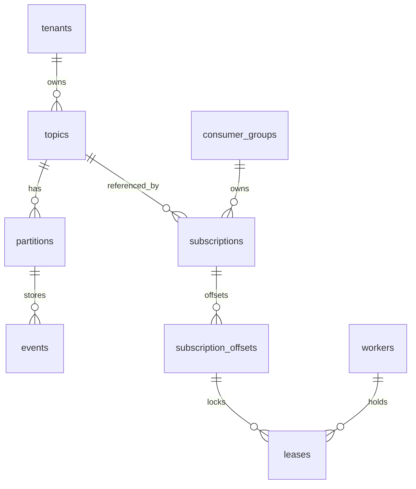
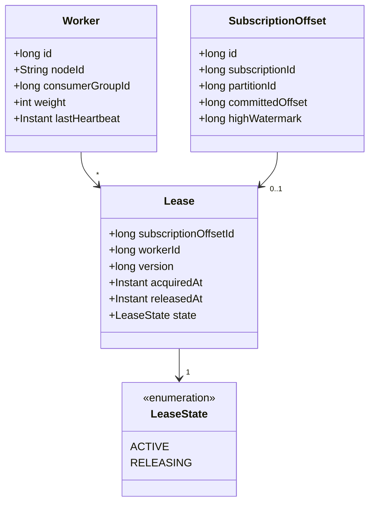
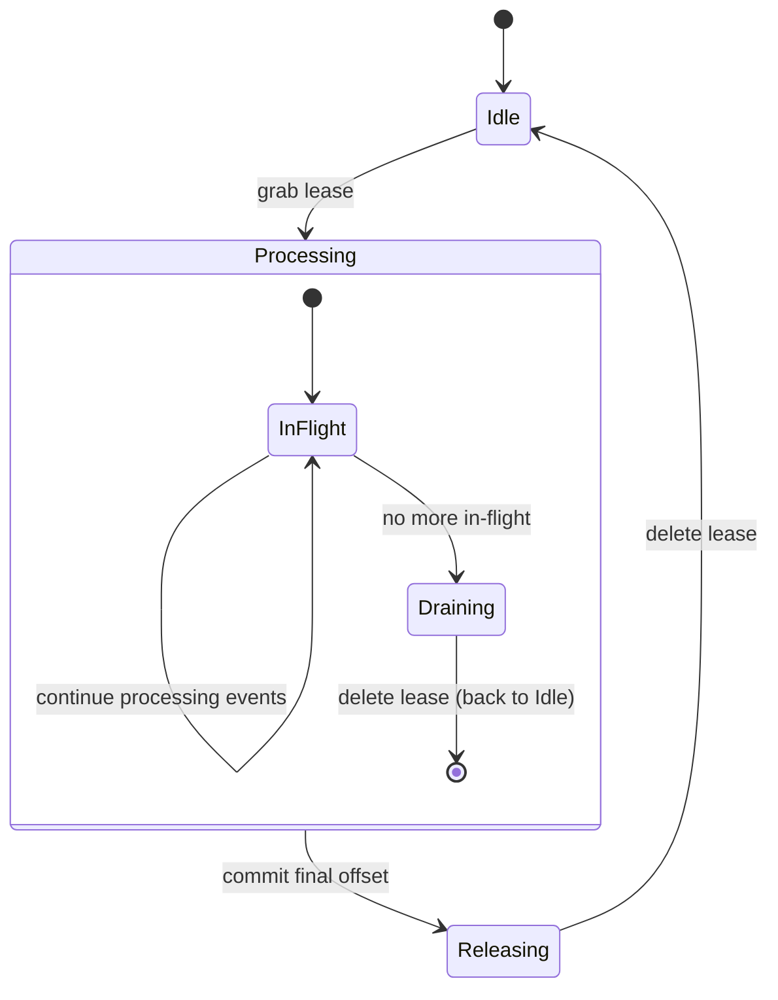

# Boxy


Boxy is a multi-tenant event streaming library that exposes Kafka-like semantics directly over a database’s transactional outbox. It targets monolithic applications that need event streaming without taking on the operational cost of complex systems like Kafka or Pulsar. Boxy turns your transactional outbox into an event-stream, and allows you to build asynchronous workers in your favorite language to consume events. Boxy is **not** intended as a central event streaming platform.

Boxy is released under the **Apache License 2.0** and remains a work in progress.

## Table of Contents

- [Design Highlights](#design-highlights)
- [Architecture Decisions](#architecture-decisions)
- [Limits](#limits)
- [Roadmap](#roadmap)
- [Boxy Core and Boxy DB Overview](#boxy-core-and-boxy-db-overview)
  - [Key Tables and Views](#key-tables-and-views)
  - [Consumer Group Statistics](#consumer-group-statistics)
- [Domain Classes](#domain-classes)
- [Worker State](#worker-state)
- [Lease State](#lease-state)
- [State Change Example](#state-change-example)
- [Heartbeats](#heartbeats)
- [Work-Stealing Lease Protocol](#work-stealing-lease-protocol)
- [Building the Project](#building-the-project)
- [Getting Started](#getting-started)
- [FAQ](#faq)
- [Contributing](#contributing)
- [License](#license)

## Design Highlights

- **Decentralized, Randomized Work-Stealing** for lease distribution
- **Fair-share Load Balancing** across worker nodes, proportional to capacity weights
- **Low Consumer Lag**: p99 ~5ms for active partitions, and ~100ms for cold partitions
- **Scalable Polling**: workers stagger lease grabs to minimize database queries (e.g. ≈10 checks/s instead of hundreds)

## Architecture Decisions
- APIs for consumers and producers are kept simple, easy to integrate, and easy to use.
- Publishing an event should be possible when only knowing the tenant name and topic name.
- Third-party libraries are minimized to those that are necessary.
- For safety: boxy never deletes events. Event deletion is left to be orchestrated by you.
- For easy portability across programming languages and runtimes, all mutations are strictly performed by stored procedures.
- Tenant and Topic Names are case-sensitive.

## Limits
- Each topic has a practical limit of 1024 partitions, and a technical limit of 65536 partitions
- Each consumer group has a practical limit of 1024 workers.

## Roadmap

### V1 (August 2025)

1. Simple Worker API for Java
2. Simple Producer API for Java

### V2 (September 2025)

1. Multi-language Worker APIs (Java, Go, Rust, Python, CLI) 
2. Multi-language Producer APIs
3. Postgres support

---

## Boxy Core and Boxy DB Overview

Liquibase migrations for the schema are under `boxy-core/src/main/resources/db/changelog`. The schema models:



### Key Tables and Views

- **workers**: registers each node’s `consumer_group`, `node_id`, `weight`, and `last_heartbeat`.
- **subscription_offsets**: tracks the committed offset per (subscription, partition).
- **leases**: one row per `subscription_offset` when a node holds a lease, with `state` indicating whether it's 'ACTIVE' or 'RELEASING'.
- **leases_available_view**: shows active, unleased partitions that can be claimed.
- **consumer_groups**: stores configuration and precomputed statistics for each consumer group.

### Consumer Group Statistics

The `consumer_groups` table stores precomputed statistics that are updated with each worker check-in:

- **total_weight**: Sum of weights of all active workers in the consumer group.
- **active_partitions**: Count of partitions with new events (high_watermark > committed_offset).
- **active_workers**: Count of workers with valid heartbeats.
- **last_updated**: Timestamp of the last statistics update.
- **release_deadline**: Configurable deadline (in seconds) for how long a lease remains in the 'RELEASING' state before being deleted.

These statistics are used for:

1. **Fair Share Calculation**: The ideal share of leases for each worker is calculated as `(worker_weight / total_weight) * active_partitions`.
2. **Adaptive Heartbeat Intervals**: The heartbeat interval is adjusted based on the number of active workers to maintain a target QPS (queries per second) for the cluster.
3. **Garbage Collection**: The release_deadline determines how long a lease remains in the 'RELEASING' state before being deleted.

Precomputing these statistics reduces the need for expensive queries during worker check-ins and ensures consistent fair share calculations across all workers.

## Domain Classes

The Boxy Core module uses Java records to model the schema. Relevant classes:




## Worker State

Each worker runs in one of three high-level states with respect to a given partition:
 
      [Idle] ──(grab lease)──> [Processing] ──(drain completed)──> [Releasing] ──(confirm release)──> [Idle]

**Idle**
- No lease held on this partition; not processing.
- Periodically (per the work-steal loop) it may grab new leases if under-loaded.

**Processing**
- Lease acquired with state='ACTIVE' and an event batch is in-flight.
- Worker reads events, calls handlers, and updates the offset as it goes.

**Releasing**
- Release can occur in two scenarios: 1) all in-flight work is done and the final offset is committed, 2) the worker is determined to have an unfair share of leases.
- The lease is marked as state='RELEASING' with a timestamp in released_at.
- The worker must finish its current batch and commit offsets before the lease is fully released.
- After a configurable deadline (default 10 seconds), the lease is deleted by the garbage collection process.
- This controlled release is intended to reduce the occurrence of duplicate message processing.
- Once the lease is deleted, the worker transitions back to Idle.

This design minimizes leases on cold partitions, to reduce the total number of queries to the database, and ensures that workers can finish processing in-flight events before leases are reassigned.

## Lease State

Each lease row goes through the following states:

      [Available] ──(INSERT/UPSERT)──> [ACTIVE] ──(UPDATE)──> [RELEASING] ──(DELETE)──> [Available]

**Available (leases_available_view)**

- Partition is active (high_watermark > committed_offset) but unleased.
- Any under-loaded worker can pick it up via a randomized grab.

**ACTIVE (leases row exists with state='ACTIVE')**
- The worker is actively processing events from this partition.
- The lease can be marked for release if the worker has more leases than its fair share.

**RELEASING (leases row exists with state='RELEASING')**
- The worker is finishing processing any in-flight events before the lease is fully released.
- The `released_at` timestamp tracks when the release process started.
- After a configurable deadline (default 10 seconds), the lease is deleted by the garbage collection process.
- Leases in the RELEASING state are not available for acquisition by other workers.



## State Change Example

      t=0s    Worker A grabs lease on P42 → state Idle→Processing, lease created
      t=0–2s  A processes events 101–105 → in-flight
      t=3s    A commits offset=105, no more in-flight → transition to Releasing
      t=3s    A issues DELETE FROM leases WHERE X → lease row gone
      t=4s    New event arrives in P42 → shows up in leases_available_view
      t=5s    Worker B grabs lease on P42 → begins Processing


## Heartbeats

Node-level heartbeat (in the workers table) remains independent of per-partition state.

Rather than each worker writing every X seconds, we define:

- T<sub>cycle</sub>: a fixed “heartbeat cycle” (e.g. 1 s)

- QPS<sub>target</sub>: the desired total heartbeats/sec for the whole cluster (e.g. 10 qps)

On each cycle, each worker flips a weighted coin with probability `p = min(1, QPS_target / N_active)`, 
and only writes a heartbeat if it “wins” that flip.

Properties
- When N_active ≤ Q_target, then p = 1 → everyone writes → we get N_active QPS (fine for small clusters).
- When N_active > Q_target, then p = Q_target / N_active → expected cluster rate ≈ Q_target, irrespective of N.
- We detect failures in a bounded time: expected per-worker heartbeat interval = 1 s / p = N_active / Q_target seconds; 
  we pick the dead‐timeout to be a small multiple of that (e.g. 3×).


  
## Work-Stealing Lease Protocol

The work-stealing algorithm is implemented in the `sp_workers_check_in` stored procedure and its sub-procedures. The algorithm works as follows:

1. **Consumer Group Statistics Update**:
   - The procedure updates precomputed statistics in the `consumer_groups` table:
     - `total_weight`: Sum of weights of all active workers
     - `active_partitions`: Count of partitions with new events (high_watermark > committed_offset)
     - `active_workers`: Count of workers with valid heartbeats
   - These statistics are used for fair share calculation and adaptive heartbeat intervals.

2. **Fair-Share Calculation**:
    - Let `Wᵢ` = worker weight, `T` = total active weight, `P` = active partitions.
    - Ideal share `Sᵢ = (Wᵢ / T) * P` with slack Δ (default 10%) to prevent oscillation.
    - Min leases = ⌊Sᵢ * (1 - Δ)⌋, Max leases = ⌈Sᵢ * (1 + Δ)⌉

3. **Release Excess**: 
   - If held leases > Max leases, mark the least-backlogged leases as 'RELEASING'.
   - Leases are prioritized for release based on the smallest backlog (high_watermark - committed_offset).
   - Released leases are not immediately deleted but enter a 'RELEASING' state with a timestamp.

4. **Grab More**: 
   - If held leases < Min leases, acquire more leases from the `leases_available_view`.
   - The algorithm uses a randomized pivot point to minimize contention.
   - It performs two passes if necessary: first from the pivot to the end, then from the beginning to the pivot.
   - Leases are acquired with state='ACTIVE' and no released_at timestamp.

5. **Process**: 
   - For each held lease in the 'ACTIVE' state, read events > `committed_offset`, process in-order, then update `committed_offset`.
   - Leases in the 'RELEASING' state are allowed to finish processing before being deleted.

6. **Garbage Collection**:
   - Leases in the 'RELEASING' state are deleted after a configurable deadline (default 10 seconds).
   - Expired workers and their leases are deleted if they miss their heartbeat deadline.

This algorithm ensures:

- **Proportional fairness** by weight
- **Low churn** via slack Δ and batched grabs/releases
- **Minimal DB load** through randomized, staggered scans
- **In-order processing** (one lease-holder per partition)
- **Duplicate-safety** on failover
- **Graceful handover** of leases through the 'RELEASING' state


## Building the Project

Boxy uses Maven and requires Java 17+. From the root:

```bash
mvn clean package
```

Integration tests use Testcontainers with MySQL (default) or Postgres. Configure via env vars:

| Variable      | Default       | Description           |
| ------------- | ------------- | --------------------- |
| `DB_TYPE`     | `mysql`       | `mysql` or `postgres` |
| `DB_HOST`     | `localhost`   | Database host         |
| `DB_PORT`     | `3306`/`5432` | Database port         |
| `DB_NAME`     | `events_db`   | Schema name           |
| `DB_USER`     | `user`        | Database user         |
| `DB_PASSWORD` | `password`    | Database password     |

## Getting Started

### Prerequisites

1. Java 17 or higher
2. MySQL 8.0+ or PostgreSQL 12+
3. Maven 3.6+

### Database Setup

1. Create a database for Boxy:

```sql
CREATE DATABASE events_db;
CREATE USER 'user'@'localhost' IDENTIFIED BY 'password';
GRANT ALL PRIVILEGES ON events_db.* TO 'user'@'localhost';
```

2. Run the Liquibase migrations to set up the schema:

```bash
mvn liquibase:update -Dliquibase.url=jdbc:mysql://localhost:3306/events_db -Dliquibase.username=user -Dliquibase.password=password
```

### Producer Example

```java
// Create a producer
DataSource dataSource = createDataSource(); // Your DataSource implementation
BoxyProducer producer = BoxyProducer.create(dataSource);

// Publish an event
String tenant = "mycompany";
String topic = "orders";
Map<String, Object> event = Map.of(
    "orderId", "12345",
    "customerId", "67890",
    "amount", 99.99,
    "timestamp", System.currentTimeMillis()
);

producer.publish(tenant, topic, event);
```

### Consumer Example

```java
// Create a consumer group
DataSource dataSource = createDataSource(); // Your DataSource implementation
String tenant = "mycompany";
String consumerGroup = "order-processor";
BoxyConsumerGroup consumerGroup = BoxyConsumerGroup.create(dataSource, tenant, consumerGroup);

// Subscribe to a topic
consumerGroup.subscribe("orders");

// Create a worker
String nodeId = "worker-1";
BoxyWorker worker = consumerGroup.createWorker(nodeId);

// Register event handler
worker.registerHandler("orders", event -> {
    System.out.println("Processing order: " + event.get("orderId"));
    // Process the event
    return true; // Return true to commit the offset
});

// Start the worker
worker.start();

// Shutdown hook
Runtime.getRuntime().addShutdownHook(new Thread(worker::shutdown));
```

### Advanced Configuration

You can configure various aspects of Boxy:

```java
BoxyConsumerGroup consumerGroup = BoxyConsumerGroup.builder()
    .dataSource(dataSource)
    .tenant("mycompany")
    .name("order-processor")
    .heartbeatIntervalDefault(3.0) // Default heartbeat interval in seconds
    .heartbeatQpsTarget(10.0)      // Target heartbeats per second for the cluster
    .releaseDeadline(10)           // Seconds to wait before cleaning up releasing leases
    .build();

BoxyWorker worker = consumerGroup.createWorker(BoxyWorker.builder()
    .nodeId("worker-1")
    .weight(2)                     // Higher weight gets proportionally more partitions
    .build());
```

## FAQ

#### How is the schema managed?
Liquibase is used for schema management, but we do not use the database agnostic schema definitions. When this was attempted it was found that 1) the resulting YAML files were overly complex and required too many exceptions, and 2) the generated schemas would not perform as well as hand-crafted schemas without additional exceptions. Since we aim to support a wide range of databases, a decision was made to maintain complete control over the schema.

## Contributing

Contributions to Boxy are welcome! Here's how you can contribute:

1. **Fork the Repository**: Start by forking the repository on GitHub.

2. **Create a Branch**: Create a branch for your feature or bugfix.
   ```bash
   git checkout -b feature/your-feature-name
   ```

3. **Make Changes**: Implement your changes, following the existing code style.

4. **Write Tests**: Add tests for your changes to ensure they work correctly.

5. **Run Tests**: Make sure all tests pass before submitting your changes.
   ```bash
   mvn test
   ```

6. **Submit a Pull Request**: Push your changes to your fork and submit a pull request to the main repository.

### Development Guidelines

- Follow the existing code style and conventions.
- Keep changes focused on a single issue or feature.
- Document new code with Javadoc comments.
- Update the README.md if your changes affect the public API or usage instructions.
- Add appropriate tests for your changes.

## License

Boxy is released under the Apache License 2.0. See the [LICENSE](LICENSE) file for details.
See the License for the specific language governing permissions and
limitations under the License.

