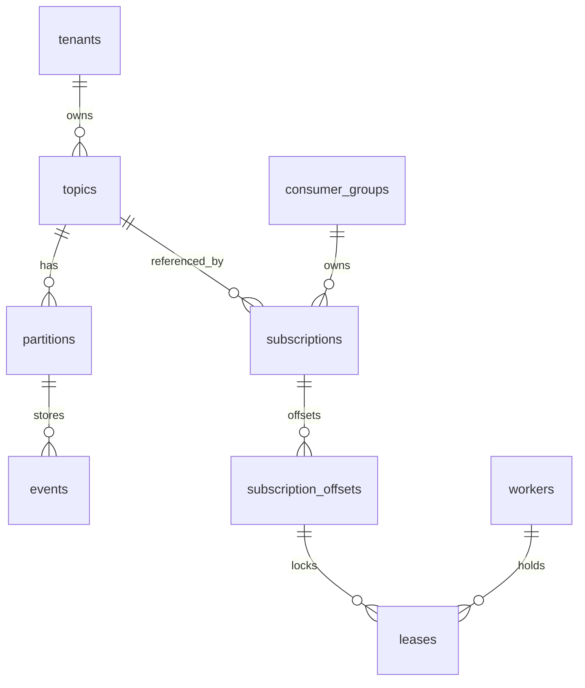
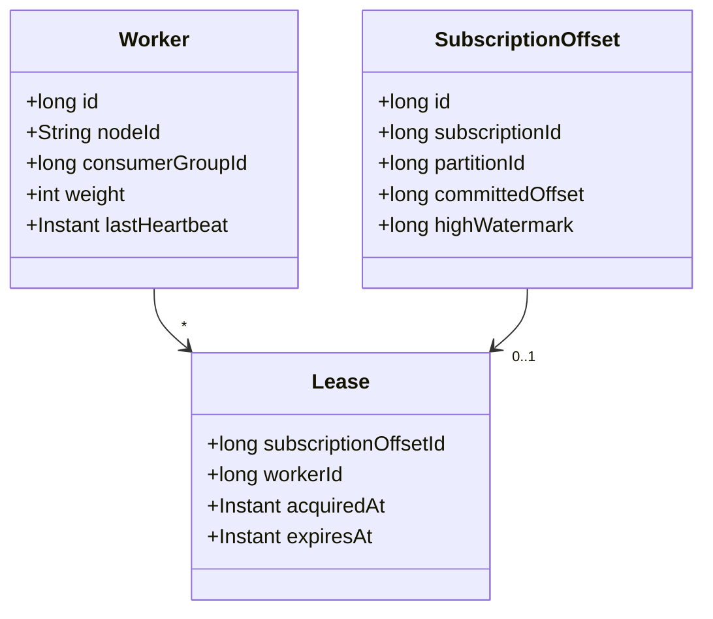
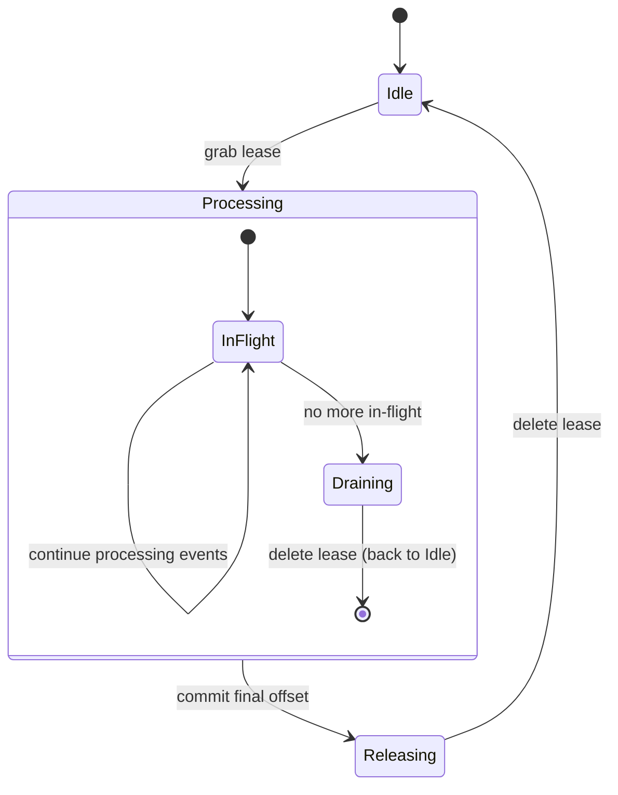

# Boxy


Boxy is a multi-tenant event streaming library that exposes Kafka-like semantics directly over a database’s transactional outbox. It targets monolithic applications that need event streaming without taking on the operational cost of complex systems like Kafka or Pulsar. Boxy turns your transactional outbox into an event-stream, and allows you to build asynchronous workers in your favorite language to consume events. Boxy is **not** intended as a central event streaming platform.

Boxy is released under the **Apache License 2.0** and remains a work in progress.

## Design Highlights

- **Decentralized, Randomized Work-Stealing** for lease distribution
- **Fair-share Load Balancing** across worker nodes, proportional to capacity weights
- **Low Consumer Lag**: p99 ~5ms for active partitions, and ~100ms for cold partitions
- **Scalable Polling**: workers stagger lease grabs to minimize database queries (e.g. ≈10 checks/s instead of hundreds)

## Architecture Decisions
- APIs for consumers and producers are kept simple, easy to integrate, and easy to use.
- Publishing an event should be possible when only knowing the tenant name and topic name.
- Third-party libraries are minimized to those that are necessary.
- For safety: boxy never deletes events. Event deletion is left to be orchestrated by you.
- For easy portability across programming languages and runtimes, all mutations are strictly performed by stored procedures.
- Tenant and Topic Names are case-sensitive.

## Limits
- Each topic has a practical limit of 1024 partitions, and a technical limit of 65536 partitions
- Each consumer group has a practical limit of 1024 workers.

## Roadmap

### V1 (August 2025)

1. Simple Worker API for Java
2. Simple Producer API for Java

### V2 (September 2025)

1. Multi-language Worker APIs (Java, Go, Rust, Python, CLI) 
2. Multi-language Producer APIs
3. Postgres support

---

## Boxy Core and Boxy DB Overview

Liquibase migrations for the schema are under `boxy-core/src/main/resources/db/changelog`. The schema models:



### Key Tables and Views

- **workers**: registers each node’s `consumer_group`, `node_id`, `weight`, and `last_heartbeat`.
- **subscription_offsets**: tracks the committed offset per (subscription, partition).
- **leases**: one row per `subscription_offset` when a node holds a lease until `expires_at`.
- **leases_available_view**: shows active, unleased partitions that can be claimed.

## Domain Classes

The Boxy Core module uses Java records to model the schema. Relevant classes:




## Worker State

Each worker runs in one of three high-level states with respect to a given partition:
 
      [Idle] ──(grab lease)──> [Processing] ──(drain completed)──> [Releasing] ──(confirm release)──> [Idle]

**Idle**
- No lease held on this partition; not processing.
- Periodically (per the work-steal loop) it may grab new leases if under-loaded.

**Processing**
- Lease acquired and an event batch is in-flight.
- Worker reads events, calls handlers, and updates the offset as it goes.
- It continues renewing the lease on this partition: once N seconds, 
  or possibly commit of offsets (to-be-determined). 

**Releasing**
- Release can occur in two scenarios: 1) all in-flight work is done and the final offset is committed, 2) the worker is determined to have an unfair share of leases.
  It must finish its current batch and commit offsets, and must then release. This controlled release is intended to prevent
  reduce occurrence of duplicate message processing.
- When releasing, a worker deletes (DELETE FROM leases WHERE subscription_offset_id = X AND worker_id = Y) its lease row.
- It then transitions back to Idle.

This design minimizes leases on cold partitions, to reduce the total number of queries to the database.

## Lease State

Each leases row similarly goes through:

      [Available] ──(INSERT/UPSERT)──> [Held] ──(DELETE)──> [Available]

**Available (leases_available_view)**

- Partition is active (high_watermark > committed_offset) but unleased.
- Any under-loaded worker can pick it up via a randomized grab.

**Held (leases row exists with current worker_id)**
- The owning worker keeps it alive by renewing before expires_at.
- Once the worker finishes and enters Releasing, it deletes this row, making it immediately Available again.



## State Change Example

      t=0s    Worker A grabs lease on P42 → state Idle→Processing, lease created
      t=0–2s  A processes events 101–105 → in-flight, renew lease at t≈10s
      t=3s    A commits offset=105, no more in-flight → transition to Releasing
      t=3s    A issues DELETE FROM leases WHERE X → lease row gone
      t=4s    New event arrives in P42 → shows up in leases_available_view
      t=5s    Worker B grabs lease on P42 → begins Processing


## Heartbeats

Node-level heartbeat (in the workers table) remains independent of per-partition state.

Rather than each worker writing every X seconds, we define:

- T<sub>cycle</sub>: a fixed “heartbeat cycle” (e.g. 1 s)

- QPS<sub>target</sub>: the desired total heartbeats/sec for the whole cluster (e.g. 10 qps)

On each cycle, each worker flips a weighted coin with probability `p = min(1, QPS_target / N_active)`, 
and only writes a heartbeat if it “wins” that flip.

Properties
- When N_active ≤ Q_target, then p = 1 → everyone writes → we get N_active QPS (fine for small clusters).
- When N_active > Q_target, then p = Q_target / N_active → expected cluster rate ≈ Q_target, irrespective of N.
- We detect failures in a bounded time: expected per-worker heartbeat interval = 1 s / p = N_active / Q_target seconds; 
  we pick the dead‐timeout to be a small multiple of that (e.g. 3×).


  
## Work-Stealing Lease Protocol

1. **Fair-Share Calculation**:
    - Let `Wᵢ` = worker weight, `T` = total active weight, `P` = active partition count.
    - Ideal share `Sᵢ = (Wᵢ / T) * P` with slack Δ to prevent oscillation.
3. **Release Excess**: if held leases > ⌊Sᵢ⌋ + Δ, delete the least-backlogged leases.
4. **Grab More**: if held leases < ⌈Sᵢ⌉ − Δ, pick a random pivot in `leases_available_view` and `SELECT ... LIMIT` to fetch N new `subscription_offset_id`s, then upsert into `leases`.
5. **Process**: for each held lease, read events > `committed_offset`, process in-order, then update `committed_offset`.
6. **Renew** leases at \~⅓ TTL (e.g. 10s on a 30s lease) to avoid expiration. A renewal can be packaged with an offset commit. 

This loop ensures:

- **Proportional fairness** by weight
- **Low churn** via slack Δ and batched grabs/releases
- **Minimal DB load** through randomized, staggered scans
- **In-order processing** (one lease-holder per partition)
- **Duplicate-safety** on failover


## Building the Project

Boxy uses Maven and requires Java 17+. From the root:

```bash
mvn clean package
```

Integration tests use Testcontainers with MySQL (default) or Postgres. Configure via env vars:

| Variable      | Default       | Description           |
| ------------- | ------------- | --------------------- |
| `DB_TYPE`     | `mysql`       | `mysql` or `postgres` |
| `DB_HOST`     | `localhost`   | Database host         |
| `DB_PORT`     | `3306`/`5432` | Database port         |
| `DB_NAME`     | `events_db`   | Schema name           |
| `DB_USER`     | `user`        | Database user         |
| `DB_PASSWORD` | `password`    | Database password     |


## FAQ

#### How is the schema managed?
Liquibase is used for schema management, but we do not use the database agnostic schema definitions. When this was attempted it was found that 1) the resulting YAML files were overly complex and required too many exceptions, and 2) the generated schemas would not perform as well as hand-crafted schemas without additional exceptions. Since we aim to support a wide range of databases, a decision was made to maintain complete control over the schema.

