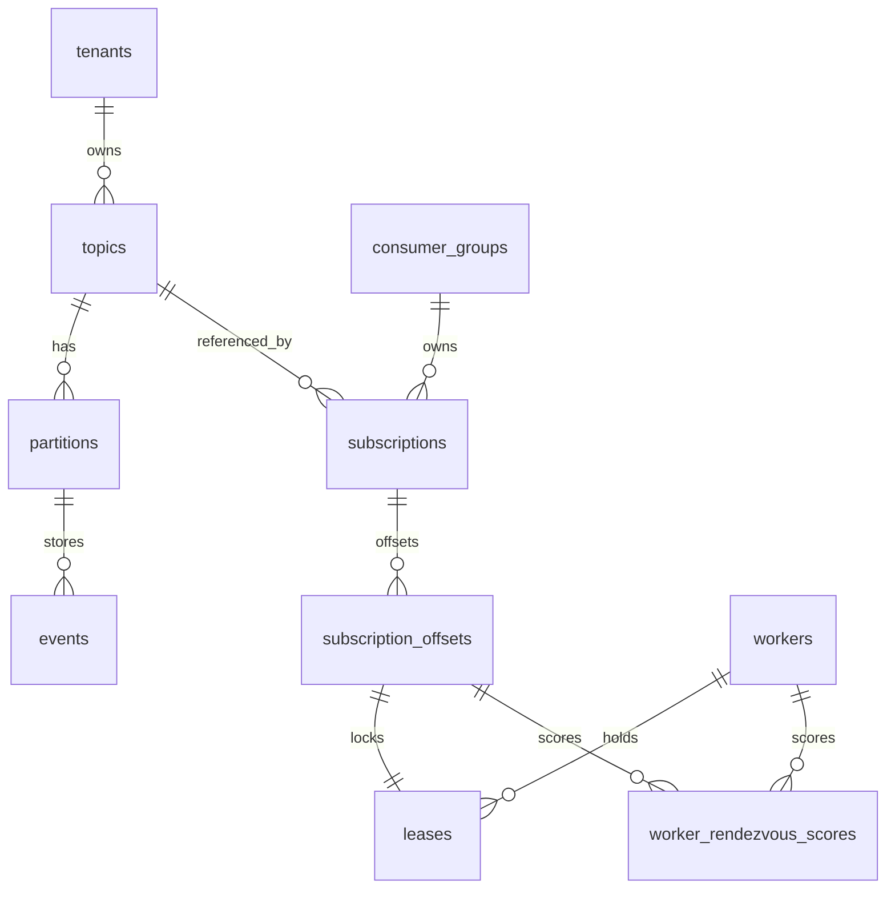
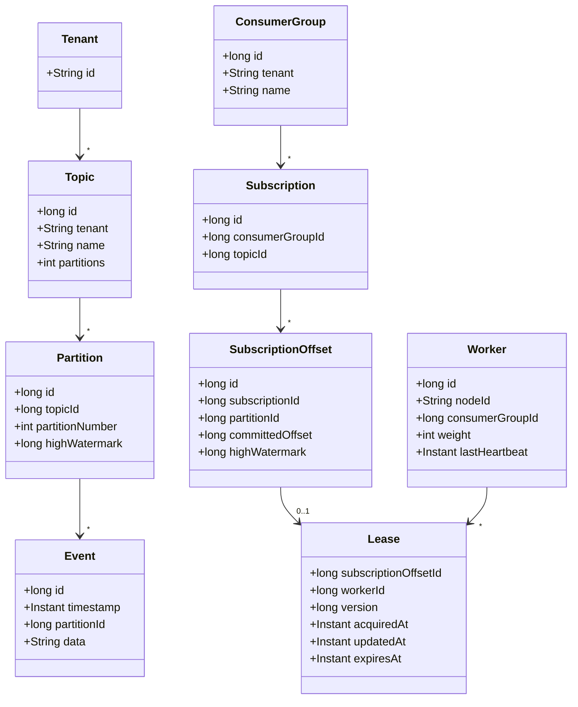
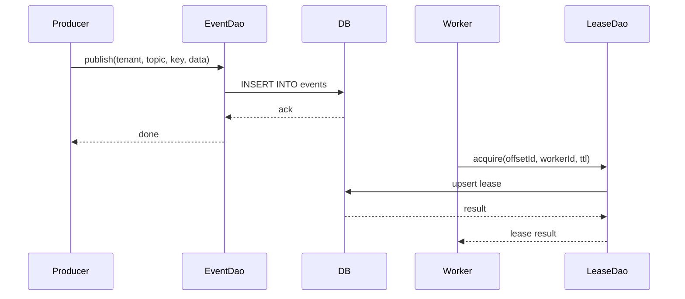

<div style="text-align:center">
<picture style="padding:100px;margin-bottom:0px">
   
</picture>
</div>

# Boxy

Boxy is a multi-tenant event streaming library that exposes Kafka-like semantics directly over a database's transactional outbox. It targets monolithic applications that need event streaming without taking on the operational cost of more complex systems like Kafka or Pulsar. Boxy turns your transactional outbox into an event-stream, and will allow you to build asynchronous workers in your favorite programming language, to consume events from those streams. Boxy is specifically **not** designed to be a central event streaming platform. 

Boxy is released under the **Apache Software License 2.0 (ASL 2.0)** and remains a work in progress.

The design emphasises fairness and scalability:

* Fair work distribution across tenants and across topics
* Fair scheduling of worker nodes so consumer groups can scale out to **1024** workers with minimal load on the database
* Boxy is designed to have a p99 consumer lag of <5ms for active partitions, <100ms for recently active partitions, and <200ms for inactive partitions that become active.

Currently the only module in use is **boxy-persistence**, which provides the database schema, DAO interfaces and integration tests. The API modules `boxy-api-consumer`, `boxy-api-producer` and `boxy-api-worker` are placeholders for future functionality. 

## Roadmap

### V1 (August 2025)
1. Simple Worker API for Java
2. Simple Producer API for Java

### V2 (September 2025)
1. Worker APIs for Java, Go, Rust, Python, CLI, etc... using https://smithy.io/2.0/
2. Producer API for Java, Go, Rust, Python, CI, etc... using https://smithy.io/2.0/
3. Postgres support

---

## Persistence overview

Liquibase migrations describing the schema live under `boxy-persistence/src/main/resources/db/changelog`. The schema models Kafka-like topics, partitions and consumer groups as shown below.



## Domain classes

The persistence module uses Java records to model the schema. Their relationships are shown below.



## Typical workflow

Workers acquire leases on `subscription_offsets` to process new events and maintain offsets. The simplified sequence below illustrates publishing an event and a worker acquiring a lease.



## Building the project

Boxy is built with Maven and requires a modern JDK. From the repository root run:

```bash
mvn clean package
```

Integration tests start a MySQL container via Testcontainers. Connection parameters are resolved by `DataSourceProvider` using environment variables:

| Variable      | Default    | Description                              |
|---------------|-----------|------------------------------------------|
| `DB_TYPE`     | `mysql`   | Database type (`mysql` or `postgres`)    |
| `DB_HOST`     | `localhost` | Database host                             |
| `DB_PORT`     | `3306` (mysql) / `5432` (postgres)| Database port |
| `DB_NAME`     | `events_db` | Schema name                               |
| `DB_USER`     | `user`      | Database user                             |
| `DB_PASSWORD` | `password`  | Database password                         |

